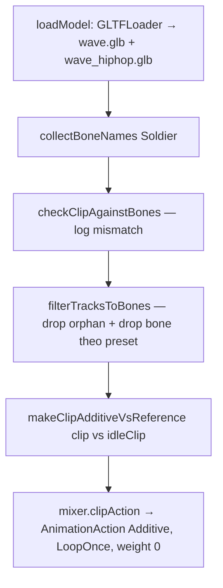

# Animation Gesture Overlay — Pipeline & Logic

> Tài liệu kỹ thuật cho `script/animation/loader.js` và phần gesture trong
> `script/animation/animation_character.js`. Mục tiêu: nạp clip Mixamo
> (`wave.glb`, `wave_hiphop.glb`) và overlay lên skeleton `Soldier.glb` mà
> không bị flip 180°, không trượt sàn, không đè locomotion.

---

## 1. Bối cảnh

| Asset                         | Vai trò                                                | Nguồn                          |
| ----------------------------- | ------------------------------------------------------ | ------------------------------ |
| `models/gltf/Soldier.glb`     | nhân vật chính + 3 clip nội bộ (`idle`, `walk`, `run`) | three.js examples (rig Mixamo) |
| `models/gltf/wave.glb`        | clip vẫy tay đơn giản                                  | Mixamo                         |
| `models/gltf/wave_hiphop.glb` | clip hiphop dance toàn thân                            | Mixamo                         |

Cả 3 file đều cùng rig **Mixamo**: 49 bone, prefix `mixamorig*`. Tuy nhiên các
clip Mixamo được export từ **rig nguồn** (không phải Soldier), nên có 2 sai lệch
phổ biến:

1. **Bone "lá"** (`*_End`, `Pinky3`, `Thumb4`…) tồn tại trên rig nguồn nhưng
   không có trên Soldier → tracks orphan.
2. **Bind pose orientation** của Mixamo và Soldier khác nhau ở một số bone gốc
   (`Hips`, `UpLeg`…) → quaternion local trong clip đại diện rotation tương đối
   với bind pose nguồn, áp lên Soldier sẽ lệch 180°.

---

## 2. Triệu chứng đã gặp

| Hiện tượng                                                                 | Hình              | Nguyên nhân                                                              |
| -------------------------------------------------------------------------- | ----------------- | ------------------------------------------------------------------------ |
| `THREE.PropertyBinding: No target node found for track: LeftToe_End.scale` | console warn      | Clip có bone "lá" mà Soldier không có                                    |
| Toàn bộ nhân vật **chúi đầu xuống đất, chân lên trời**                     | nhân vật úp ngược | `Hips.quaternion` của clip Mixamo chứa rotation 180° quanh forward axis  |
| Thân trên + đầu **nghiêng ngang/xoay** dù đứng đúng hướng                  | dance pose        | `Spine`/`Spine1` của clip dance có rotation lớn → đẩy nửa thân trên lệch |
| Nửa thân **dưới (đùi/chân) flip 180°** trong khi thân trên đứng đúng       | preset `fullBody` | `UpLeg.quaternion` của Mixamo bind pose lệch convention với Soldier      |

---

## 3. Khái niệm cần nắm

### 3.1 Skeleton / Bone hierarchy

`Soldier.glb` có cây bone dạng:

```
mixamorigHips
├── mixamorigSpine
│   └── mixamorigSpine1
│       └── mixamorigSpine2
│           ├── mixamorigNeck → mixamorigHead
│           ├── mixamorigLeftShoulder → LeftArm → LeftForeArm → LeftHand → fingers
│           └── mixamorigRightShoulder → RightArm → RightForeArm → RightHand → fingers
├── mixamorigLeftUpLeg → LeftLeg → LeftFoot → LeftToeBase
└── mixamorigRightUpLeg → RightLeg → RightFoot → RightToeBase
```

Mỗi bone lưu **transform local** so với parent: `position` (Vec3),
`quaternion` (Quat), `scale` (Vec3).

### 3.2 Local rotation vs world rotation

`bone.quaternion` chỉ rotation **so với parent**. World rotation =
`parent.world * bone.local`. Hệ quả quan trọng:

- Nếu cha xoay 180°, mọi con cũng xoay 180° (kế thừa).
- Nếu chỉ áp local quaternion mới cho con (cùng rotation cha), pose thay đổi
  cục bộ — không ảnh hưởng phần khác của body.
- "Forward axis" của character là rotation của bone gốc (`Hips`). Bind pose của
  Soldier có Hips facing `-Z`, bind pose của rig nguồn Mixamo có thể facing
  `+Z` → khi áp `Hips.quaternion` từ clip Mixamo lên Soldier, character lật.

### 3.3 AnimationClip / Track / Property binding

```
AnimationClip
├── tracks[]                              // KeyframeTrack
│   ├── name = "mixamorigHips.quaternion" // <node>.<property>
│   ├── times[]
│   └── values[]
└── duration
```

Khi `mixer.clipAction(clip)`, three.js tạo `PropertyBinding` cho từng track:
parse `node` từ `track.name`, tìm `Object3D` có cùng `name` trong scene root.
Không tìm thấy → log `No target node found for track: ...` và bỏ qua track.

### 3.4 Blend mode: Normal vs Additive

| Mode       | Cách hoạt động                                                                     | Khi dùng                                    |
| ---------- | ---------------------------------------------------------------------------------- | ------------------------------------------- |
| `Normal`   | Output = lerp(action₁_pose, action₂_pose, weight). Hai action ghi đè nhau.         | Locomotion crossfade (`idle ↔ walk ↔ run`). |
| `Additive` | Output = base_pose ⊕ delta. Delta là rotation/translation cộng vào pose hiện hành. | Gesture overlay lên locomotion.             |

`THREE.AnimationUtils.makeClipAdditive(clip, refFrame, refClip, fps)` biến
clip thành additive: với mỗi keyframe, **trừ** giá trị của clip tham chiếu
tại `refFrame`. Quaternion: `value = inverse(ref) * value`. Vector:
`value = value - ref`. Kết quả là **delta tương đối**, blend lên base sẽ chỉ
**cộng thêm** chuyển động chứ không thay base.

---

## 4. Pipeline 5 bước



### Bước 1 — Load GLB

`loader.js :: loadGLB / loadModel`. `Promise.all` (đã chuyển `allSettled` để
một file lỗi không kéo theo file kia). Lấy `gltf.animations[0]` của mỗi GLB.

### Bước 2 — Liệt kê bone của Soldier

`loader.js :: collectBoneNames(modelRoot) → Set<string>`. Traverse scene,
lấy `o.name` của mọi `Object3D` có `o.isBone === true`. Soldier hiện có 49
bone, tất cả prefix `mixamorig`.

### Bước 3 — Sanity check clip vs skeleton

`loader.js :: checkClipAgainstBones(clip, boneNames, { label })` log:

- Số track khớp / tổng track.
- Tập node "lá" không có trên rig (đẩy `console.debug` để tránh nhiễu).

Mục đích: phát hiện sớm rig mismatch trước khi `clipAction`. Ví dụ thực tế:

```
[clip-check] "Soldier clip: idle":  147/156 track khớp bone
[clip-check] "gesture: wave.glb":   147/195 track khớp bone
[clip-check] "gesture: wave_hiphop.glb": 147/195 track khớp bone
```

### Bước 4 — Lọc track + đổi tên về đúng bone

`loader.js :: filterTracksToBones(clip, modelRoot, options)` clone clip rồi
loại track theo các tiêu chí:

| Option             | Mặc định | Lý do                                                                                             |
| ------------------ | -------- | ------------------------------------------------------------------------------------------------- |
| `dropScale`        | `true`   | Track scale gây skin lệch khi mismatch, gesture không cần.                                        |
| `dropRoot`         | `false`  | Bỏ TẤT CẢ track của `Hips`. Bật để tránh flip forward.                                            |
| `dropRootPosition` | `true`   | Bỏ `Hips.position`, character không trượt khi clip có root motion. Bị ignore khi `dropRoot=true`. |
| `dropBonePattern`  | `null`   | RegExp drop thêm bone theo preset (xem §5).                                                       |

Đồng thời rewrite `track.name` về `${resolvedBoneName}.${property}` thông qua
`resolveSkeletonBoneName` — giải quyết khác biệt prefix `mixamorig`.

### Bước 5 — Additive vs idle

`loader.js :: makeClipAdditiveVsReference(gestureClip, idleClip, 30)`. Gesture
trở thành **delta so với pose tại idle frame 0**. Khi blend cùng `idleAction`:

- `idleAction` weight = 1 → drive base pose.
- `gestureAction` blendMode = Additive, weight = 1 → cộng delta lên base.
- Hai action không xung đột vì gesture đã được tách thành "chênh lệch", không
  còn là "pose tuyệt đối".

---

## 5. Preset drop-bone

Định nghĩa trong `animation_character.js`:

```js
const GESTURE_DROP_PRESETS = {
  upperBody: /(Hips|Spine$|Spine1$|Leg|Foot|Toe)/i,
  fullBody: /Hips/i,
};
```

| Bone                              | `upperBody` (wave) | `fullBody` (hiphop) | Lý do                                                               |
| --------------------------------- | ------------------ | ------------------- | ------------------------------------------------------------------- |
| `Hips`                            | drop               | drop                | Forward axis lệch → flip toàn thân nếu giữ.                         |
| `Spine`, `Spine1`                 | drop               | giữ                 | Cột sống dưới: clip dance làm nghiêng cả thân trên. Wave không cần. |
| `Spine2`, `Neck`, `Head`          | giữ                | giữ                 | Đầu/cổ chuyển động nhẹ, không gây flip.                             |
| `LeftShoulder…RightHand` + finger | giữ                | giữ                 | Tay vẫy / dance — tâm điểm gesture.                                 |
| `*UpLeg`, `*Leg`                  | drop               | giữ                 | Wave: chân đứng yên. Hiphop: cần đá chân.                           |
| `*Foot`, `*Toe*`                  | drop               | giữ                 | Tương tự.                                                           |

Trade-off:

- **`upperBody`**: nhân vật cứng phần dưới (chỉ tay vẫy). An toàn 100%.
- **`fullBody`**: nhân vật nhảy đủ, nhưng hiện vẫn còn flip ở phần đùi (xem §7).

---

## 6. Phát gesture (`playGesture`)

```js
function playGesture(name) {
  // 1) Tránh chồng gesture
  if (state.activeGesture) return;

  // 2) Resolve action: imported > procedural fallback (chỉ "wave")
  const action =
    state.gestureActions[name] ?? (name === "wave" ? state.waveAction : null);

  // 3) Tắt walk/run; idle = 1 nếu additive (làm base), 0 nếu normal
  const isAdditive = action.blendMode === THREE.AdditiveAnimationBlendMode;
  setWeight(state.walkAction, 0);
  setWeight(state.runAction, 0);
  setWeight(state.idleAction, isAdditive ? 1 : 0);

  // 4) Reset → fadeIn → play
  action.reset().setEffectiveWeight(1).fadeIn(0.3).play();

  // 5) Listener "finished": fadeOut, restore weight idle/walk/run từ GUI settings
  state.mixer.addEventListener("finished", state.onGestureFinished);
}
```

Ghi chú quan trọng:

- `idleAction` luôn weight **1** trong lúc gesture additive chạy → là "base
  pose" cho phép additive cộng lên. Không bao giờ để 0.
- Clip imported đã `clampWhenFinished = false` + `LoopOnce` → tự kết thúc.
- Listener gỡ chính nó sau khi xong, tránh leak handler.

---

## 7. Issue đang mở: nửa người dưới flip 180° (preset `fullBody`)

### 7.1 Hiện tượng

Khi click `wave_hiphop` (preset `fullBody`):

- Hips, Spine, Spine1, Spine2: đứng đúng hướng (do drop Hips, Spine còn lại
  rotation local nhỏ).
- Tay/đầu: đẹp.
- **Đùi (`UpLeg`) và chân (`Leg`/`Foot`/`Toe`)**: lật ngược 180° — trông như
  hai chân đá ra phía sau lưng.

### 7.2 Nguyên nhân

`UpLeg.quaternion` trong clip Mixamo lưu rotation **so với rig nguồn của
Mixamo's Hips** (giả sử facing `+Z`). Khi áp lên Soldier (Hips facing `-Z`),
`UpLeg.world = Soldier.Hips.world * Mixamo.UpLeg.local`. Vì `Mixamo.UpLeg.local`
được sinh ra với giả định cha facing `+Z`, đặt cạnh cha facing `-Z` của Soldier
sẽ ra hướng ngược lại → đùi chỉ về sau, chân lật.

`makeClipAdditive` không cứu được vì delta = `inverse(idle.UpLeg[0]) *
clip.UpLeg[t]`. Nếu `idle.UpLeg[0]` cũng có rotation A, `clip.UpLeg[t]` có
rotation `A · 180°`, delta = `A⁻¹ · A · 180° = 180°` → vẫn flip.

### 7.3 Giải pháp đề xuất

**Phương án A — drop UpLeg, giữ phần dưới đầu gối**

```js
fullBody: /(Hips|UpLeg)/i;
```

- Đùi do `idle` drive → đùi đứng yên đúng hướng.
- `Leg`/`Foot`/`Toe` vẫn animate theo clip — vì rotation local của chúng so
  với UpLeg, không chứa forward axis → không flip.

Trade-off: mất "lắc đùi" của dance. Đầu gối + bàn chân vẫn nhún được.

**Phương án B — chỉ giữ vai/tay/cổ/đầu (preset `armsOnly`)**

```js
armsOnly: /(Hips|Spine$|Spine1$|Spine2$|UpLeg|Leg|Foot|Toe)/i;
```

Áp dụng cho cả wave và hiphop. Nhân vật như mannequin: chỉ vai-tay-đầu cử
động. Đơn giản, an toàn tuyệt đối, nhưng hiphop mất tính "dance".

**Phương án C — retarget rotation offset cho UpLeg**

Áp 1 quaternion offset (`Quaternion(0,1,0,0)` = 180° quanh Y) vào trước track
`UpLeg.quaternion` của clip:

```js
for each keyframe q in UpLeg.quaternion:
  q' = OFFSET * q
```

Phức tạp, cần xác định offset chính xác từ bind pose mismatch. Giữ lại để tham
khảo, không khuyến nghị nếu phương án A đủ dùng.

### 7.4 Khuyến nghị

Trước mắt đổi preset `fullBody` thành phương án A:

```diff
 const GESTURE_DROP_PRESETS = {
   upperBody: /(Hips|Spine$|Spine1$|Leg|Foot|Toe)/i,
-  fullBody:  /Hips/i,
+  fullBody:  /(Hips|UpLeg)/i,
 };
```

Test lại `wave_hiphop`. Nếu vẫn còn flip ở `Leg` → mở rộng lên `Hips|UpLeg|Leg`.
Cứ leo dần lên parent cho tới khi pose ổn.

---

## 8. Tham chiếu API

| Hàm                                                      | File                     | Vai trò                                                |
| -------------------------------------------------------- | ------------------------ | ------------------------------------------------------ |
| `loadModel()`                                            | `loader.js`              | Load `wave.glb` + `wave_hiphop.glb`, return raw clips. |
| `getTrackNodeFromTrackName(name)`                        | `loader.js`              | Parse `node` từ `node.property`.                       |
| `collectBoneNames(modelRoot)`                            | `loader.js`              | Set tên mọi bone trên rig.                             |
| `resolveSkeletonBoneName(node, bones)`                   | `loader.js`              | Map `mixamorigHips ↔ Hips`.                            |
| `checkClipAgainstBones(clip, bones, opts)`               | `loader.js`              | Báo cáo match/orphan.                                  |
| `filterTracksToBones(clip, modelRoot, opts)`             | `loader.js`              | Lọc + rename track, return new clip.                   |
| `makeClipAdditiveVsReference(clip, ref, fps)`            | `loader.js`              | Wrapper `THREE.AnimationUtils.makeClipAdditive`.       |
| `registerGestureAction(rawClip, label, refClip, preset)` | `animation_character.js` | Pipeline 5 bước → AnimationAction.                     |
| `playGesture(name)`                                      | `animation_character.js` | Phát clip kèm crossfade weight.                        |

---

## 9. Liên quan

- `docs/animation_system.md` — tổng quan AnimationMixer của Soldier (idle/walk/run).
- `docs/arm.md` — hệ procedural wave (fallback cho `wave`, viết bằng tay 3 KeyframeTrack).
- [three.js docs — AnimationUtils.makeClipAdditive](https://threejs.org/docs/#api/en/animation/AnimationUtils.makeClipAdditive)
- [three.js docs — AdditiveAnimationBlendMode](https://threejs.org/docs/#api/en/constants/Animation)
